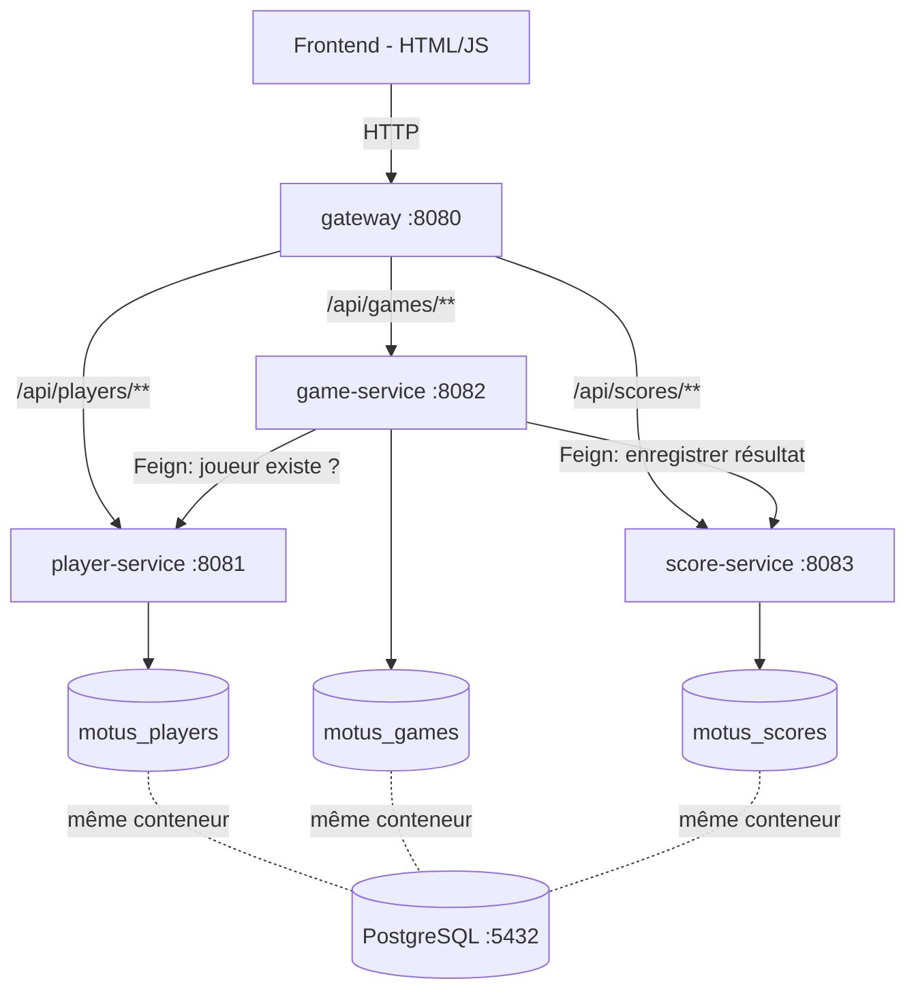
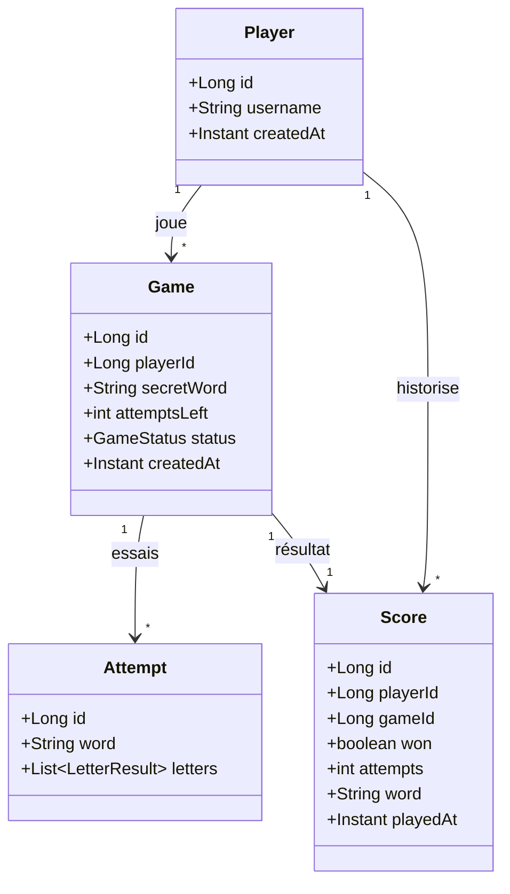

# Documentation technique — Le Mot Juste

Document support pour le rapport (diagrammes + choix techniques). Le détail des
contrats et conventions est dans [../CLAUDE.md](../CLAUDE.md).

## 1. Schéma d'architecture

## 2. Diagramme de classes « métier »

> `Game.secretWord` n'est jamais renvoyé au client tant que la partie est `IN_PROGRESS`.

## 3. Choix techniques (résumé)

- **Microservices par domaine métier** (joueurs / jeu / scores), chacun propriétaire de
  sa base → couplage faible, déploiement indépendant.
- **Une seule instance PostgreSQL**, trois bases logiques : suffisant pour le périmètre
  du projet, évite la lourdeur de trois conteneurs.
- **OpenFeign** (synchrone) pour la communication inter-services : simple et lisible,
  adapté au flux « démarrer une partie » / « enregistrer un score ».
- **Spring Cloud Gateway** comme point d'entrée unique : centralise le routage et,
  plus tard, CORS / sécurité.
- **Pas** d'Eureka / Config Server / broker de messages : périmètre volontairement
  réduit (cf. règles « on ne complique pas » dans CLAUDE.md).

## 4. À compléter

- Détails game-service (gestion du dictionnaire, génération du mot, algorithme 2 passes).
- Détails score-service (statistiques, requêtes de classement).
- Captures d'écran du frontend pour le rapport.
